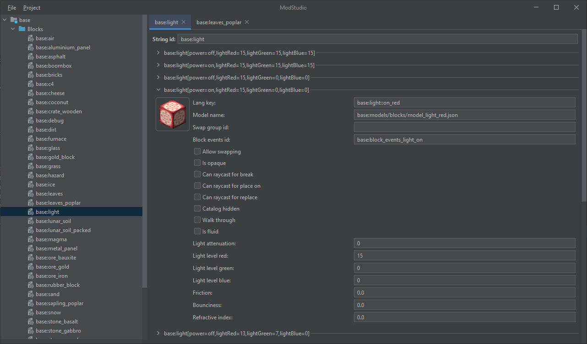

# ModStudio

[](https://github.com/TheEntropyShard/ModStudio/releases)

> [!WARNING]  
> This project is unfinished. Do not have any expectations.

**ModStudio** - a simple maker and editor for [Cosmic Reach](https://finalforeach.itch.io/cosmic-reach)'s datamods.



### Quick Start

You can either download a prebuilt jar from [Releases](https://github.com/TheEntropyShard/ModStudio/releases) page, or build it yourself. To do that you will need at least JDK 17:
```shell
$ git clone https://github.com/TheEntropyShard/ModStudio
$ cd ModStudio
$ gradlew clean build
```

Done! To run the studio, just do:
```shell
$ java -jar dist/ModStudio.jar
```

If you want to change the location of studio's files, add `--work-dir` argument:
```shell
$ java -jar dist/ModStudio.jar --work-dir C:\Users\User\Documents\CRLauncher
```

Or you can use the `--use-jar-location` argument, which will make the studio use the jar's location instead. In that case the `--work-dir` argument will be ignored:
```shell
$ java -jar dist/ModStudio.jar --use-jar-location
```
This way the studio will create its files in dist